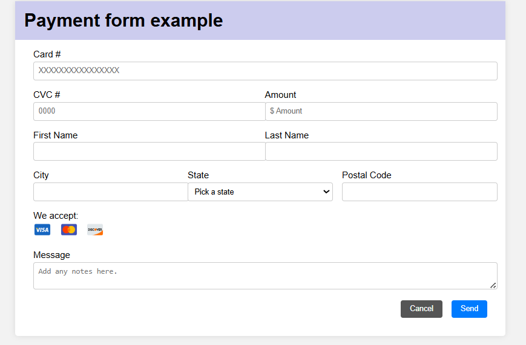

# 📝 Formulario de Pago

Este es un proyecto de formulario web centrado en la validación de datos en tiempo real utilizando HTML, CSS y JavaScript. Desarrollado como parte del bootcamp de 4Geeks Academy.

## 🎯 Objetivo

Validar entradas del formulario (número de tarjeta, CVC, monto, nombre, dirección, etc.) proporcionando feedback visual en tiempo real y un mensaje de confirmación amigable al completar correctamente el formulario.

## 🚀 Tecnologías utilizadas

- **HTML5**
- **CSS3** (diseño centrado y responsive)
- **JavaScript** (uso del DOM y validación personalizada)
- **FontAwesome** para íconos visuales

## 🔍 Funcionalidades

- ✅ Validación visual por campo (en tiempo real)
- 💬 Mensaje de éxito con animación suave
- 📱 Diseño centrado, accesible y responsive
- 🎨 Colores suaves, tipografía clara
- 🧠 Estructura semántica para buena práctica

## 📸 Vista previa

https://alejandrabarcena.github.io/FormularioEventos/

## 👩‍💻 Autora

Alejandra Bárcena
